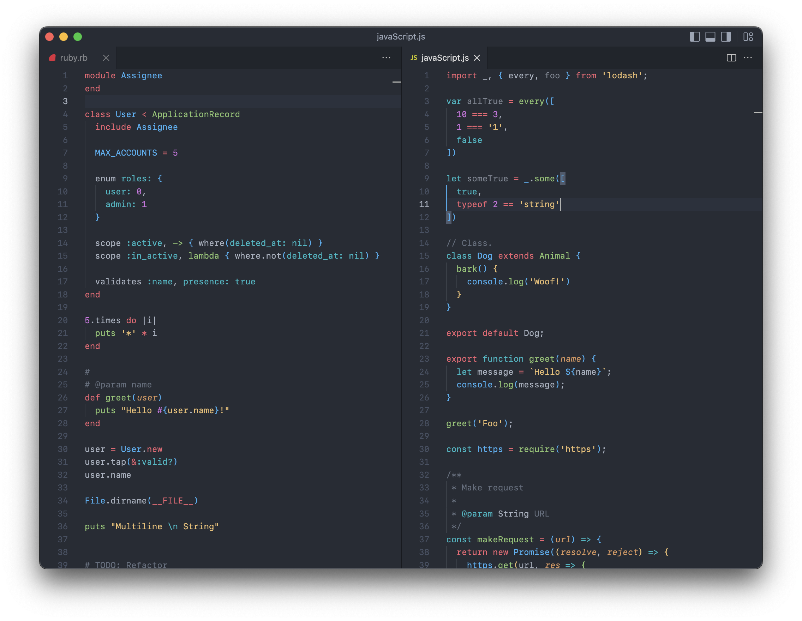

# Two Monokai Theme

Fork of [One Monokai Theme](https://github.com/azemoh/vscode-one-monokai).

<!-- [](https://marketplace.visualstudio.com/items?itemName=azemoh.one-monokai) -->
<!-- [](https://marketplace.visualstudio.com/items?itemName=azemoh.one-monokai) -->
<!-- [](https://marketplace.visualstudio.com/items?itemName=azemoh.one-monokai) -->
<!-- [](https://github.com/azemoh/vscode-one-monokai) -->


## Features
- Updated most editor colors with the ones from [One Dark Pro Theme](https://github.com/Binaryify/OneDark-Pro.git), including a darker version and a flat version
- Pair bracket colorization!
  
The colors used in this theme are mostly derived from [One Monokai Theme](https://marketplace.visualstudio.com/items?itemName=azemoh.one-monokai) and [One Dark Pro Theme](https://marketplace.visualstudio.com/items?itemName=zhuangtongfa.Material-theme).


## Install

press `ctl/command + p` to launch quick open then run
```
ext install two-monokai
```

## Screenshot
Screenshot of Ruby and JavaScript




## Changelog
You can take a look at the change log [here](https://github.com/kmnhan/vscode-two-monokai/blob/master/CHANGELOG.md)
